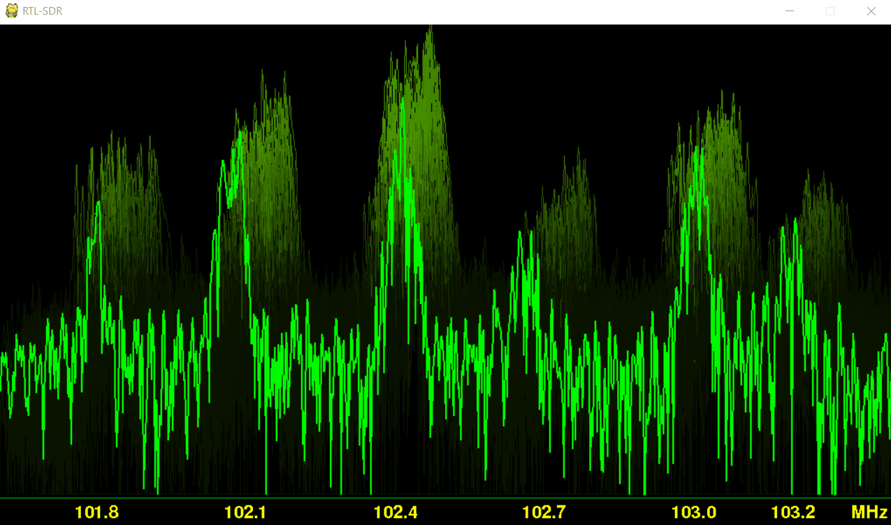

<h1 align="center">Paul G</h1>
<h3 align="center">Security Engineer | IoT Security Lead</h3>

<p align="center">
  
  <a href="https://app.hackthebox.eu/profile/323276"></a>
</p>

<p align="center"><em>Cybersecurity · IoT & Embedded · Blockchain · Automation</em></p>

---

## About Me

<table><tr><td valign="top" width="60%">

- Based in **France**, working on **IoT, mobile and cloud security**
- Leading **IoT security evaluations** for real products (routers, connected devices, embedded systems)
- Active on **standards & regulations** (EN18031, ETSI, EUCC, SBOM)
- Exploring **blockchain / Web3** and **AI-assisted security automation**
- Building **CTF challenges & security training** content
- Making security part of how products are built, shipped, and maintained — not just a checkbox

</td><td valign="top" width="40%">


</td></tr></table>

---

## What You'll Find Here

<p align="center">
  
  
  
</p>

| Area | Description |
|:-----|:------------|
| **IoT & Embedded** | Security experiments, evaluations for routers, connected devices, embedded systems |
| **Standards & Regulations** | Work around security guidelines, certifications, and compliance tooling |
| **Blockchain & Web3** | Smart contracts, DeFi mechanics, on-chain automation PoCs |
| **Security Tooling** | Scripts and automation to support evaluations and pentests |
| **CTF & Training** | Challenges and training material for security teams and trainees |

---

## Focus Areas

<details>
<summary><strong>Technology</strong></summary>

### Technology and impact

Technology is deeply embedded in our lives and infrastructure. With the right intent and discipline, it can be a force for resilience and progress instead of complexity and risk.

Day to day, I work on making security part of how products are actually built, shipped, and maintained — not just a checkbox. That means combining engineering, standards, and process so that security is systematic and repeatable.

</details>

<details>
<summary><strong>Cybersecurity</strong></summary>

### Securing the digital world

Cybersecurity is what makes digital transformation sustainable. It's the difference between innovation that lasts and innovation that gets rolled back after the first incident.

I enjoy the mix of technical depth (reverse engineering, pentesting, automation) and higher-level structure (risk, governance, repeatable methodologies). My focus is on building approaches and tooling that teams can actually use, across many products and evaluations.

</details>

<details>
<summary><strong>Internet of Things</strong></summary>

### Connected systems, real-world impact

IoT is where security becomes tangible: devices in homes, hospitals, factories, cities. A misconfiguration or weak design is no longer just "data risk" — it can affect safety, privacy, and operations.

I work on IoT security evaluations and documentation for connected products, aligning with standards and regulatory expectations and helping manufacturers understand both the technical and practical sides of securing their devices. I also build hands-on demos and CTFs to train others on how these systems can be attacked and defended.

</details>

<details>
<summary><strong>Blockchain</strong></summary>

### Why blockchain matters

Blockchain sits at the intersection of cryptography, economics and software engineering. I'm particularly interested in:

- Decentralized finance (DeFi) mechanics and the security assumptions behind them
- Smart contracts that automate interactions and enforce rules transparently
- On-chain components for tracking software artifacts, SBOMs or device identities

Beyond classic DeFi, I explore how blockchain and smart contracts can be used for **auditability, automation and transparent coordination** — especially when combined with IoT and security use cases.

</details>

> "There is no power for change greater than a community discovering what it cares about."
> — Margaret J. Wheatley

---

## Languages & Tools

<table>
  <tr>
    <td valign="top" align="center"><strong>Backend</strong><br/><br/>     </td>
    <td valign="top" align="center"><strong>DevOps</strong><br/><br/>    </td>
    <td valign="top" align="center"><strong>Frontend</strong><br/><br/>  </td>
    <td valign="top" align="center"><strong>Technologies</strong><br/><br/>   </td>
  </tr>
</table>

---

## GitHub Stats

<p align="center">
  
</p>

<p align="center">
  
</p>

<p align="center">
  
</p>

<details>
<summary><strong>More breakdown</strong></summary>

<p align="center">
  <a href="https://github.com/PaulGG-code">
    
  </a>
</p>
<p align="center">
  <a href="https://github.com/PaulGG-code">
    
  </a>
</p>
<p align="center">
  <a href="https://github.com/PaulGG-code">
    
    
  </a>
</p>

</details>

---

## WhoAmI

<details>
<summary><strong>View the <code>WhoAmI</code> snippet</strong></summary>

```python
class WhoAmI:
    user = 'Paul'
    current_work = 'Senior IoT Security Evaluator and Blockchain Manager'
    profile_overview = (
        'Security engineer working on IoT, mobile and cloud security, and blockchain.'
    )
    description_profile = (
        'IoT security evaluations, contribute to standards and EU projects, '
        'and build tools and processes that make security work repeatable and practical.'
    )
    hobbies = [
        'Building and breaking IoT devices',
        'Blockchain / Web3 experiments',
        'Designing CTF-style training challenges',
        'Skiing and travelling',
        'Ping pong',
        'Learning and teaching new things'
    ]

    def getCountry(self):
        return "France"

    def Ambitions(self):
        MakeIoTSafer()
        BuildHelpfulSecurityTools()
        GrowAndMentorSecurityTeams()
        BridgeResearchAndRealWorld()
        KeepLearningEveryYear()
        # + many more long-term projects in security and tech
```

</details>

---

## Connect

<p align="center">
  <a href="https://www.linkedin.com/in/paul-gedeon/"></a>
  <a href="https://twitter.com/0xedeon/"></a>
  <a href="https://t.me/Blockchainerr"></a>
  <a href="https://github.com/paulgg-code"></a>
  <a href="https://gedeon.herokuapp.com/"></a>
  <a href="https://app.hackthebox.eu/profile/323276"></a>
</p>

---

<details>
<summary><strong>Off-duty</strong></summary>

**Currently listening**

[](#)

**A bit of developer humor**


</details>

<!--
**PaulGG-Code/PaulGG-Code** is a special repository because its `README.md` appears on your GitHub profile.
-->
